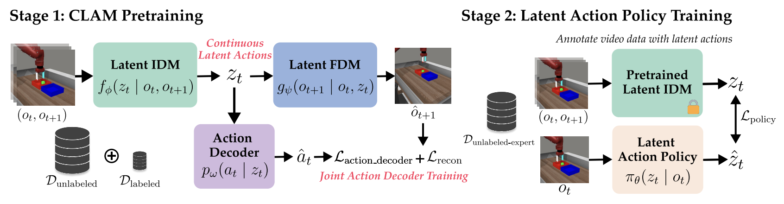

# CLAM_scr
## CLAM: Contrastive Latent Action Model

- HP: https://clamrobot.github.io/
- arXiv: https://arxiv.org/abs/2505.04999
- GitHub: https://github.com/clamrobot/clam_code



## dataset
- Video: GMControl's {walker-walk, walker-run, cheetah-run} .mp4
    - 200px
    - fps: 20
    - 3min
    - train: 30 movies
    - test: 5 movies
- Action: 6-dimensional actuator .npz

```
─ train
  ├── cheetah_run
      ├── train_0_video.mp4
      ├── train_0_actions.npz
      └──...
  └── ...
- test
  ├── cheetah_run
      ├── test_0_video.mp4
      ├── test_0_actions.npz
      └──...
  └── ...

```
## train
```
python clam_train_alg1.py
```

## TODOs
- validation
- xxx